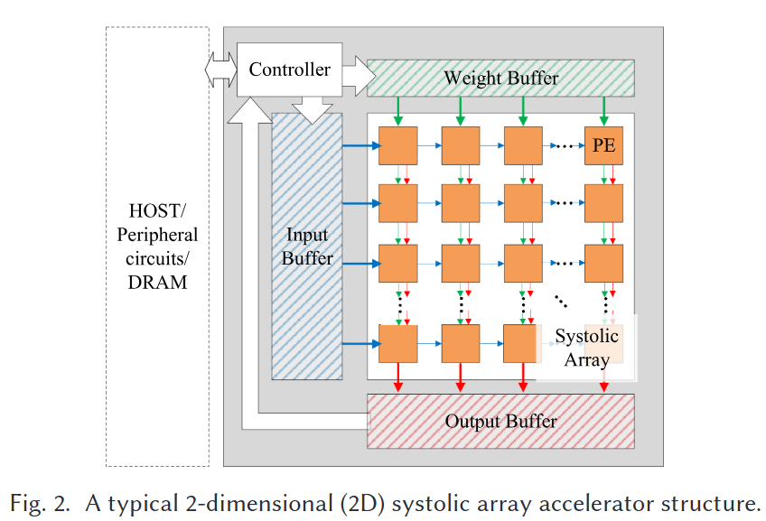
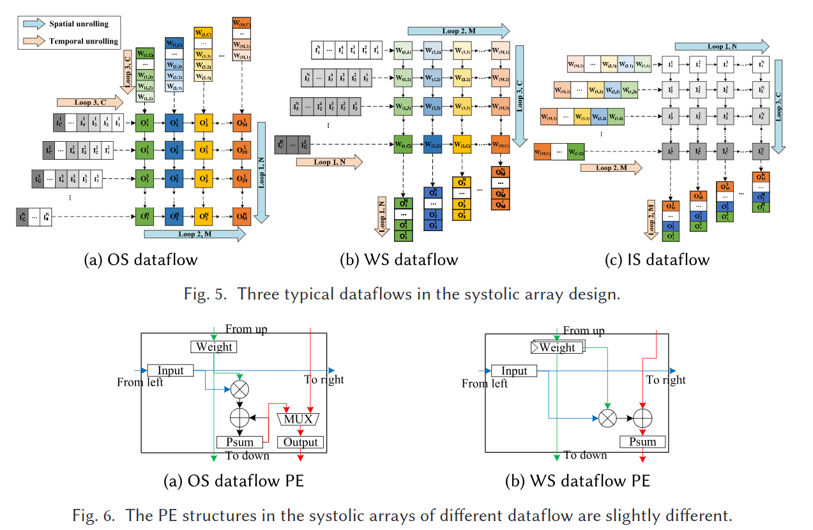
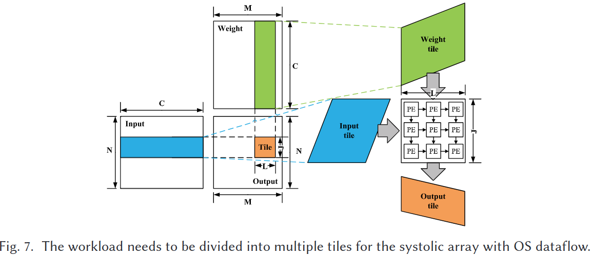
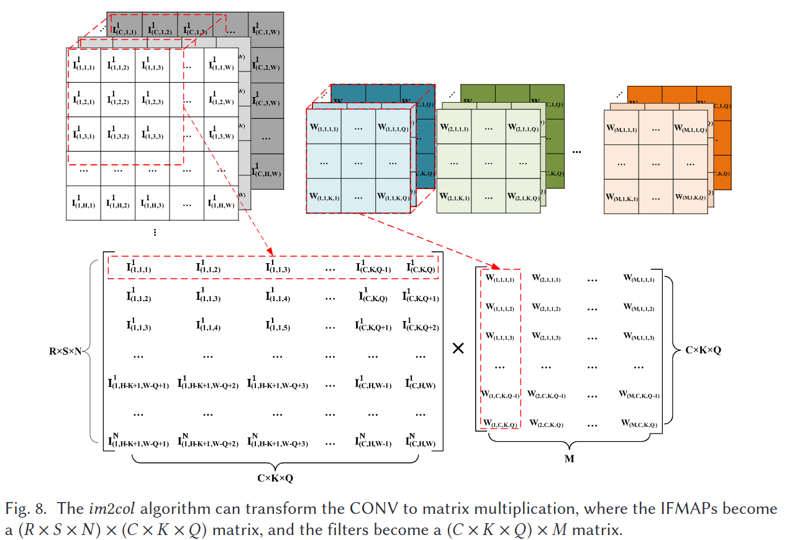
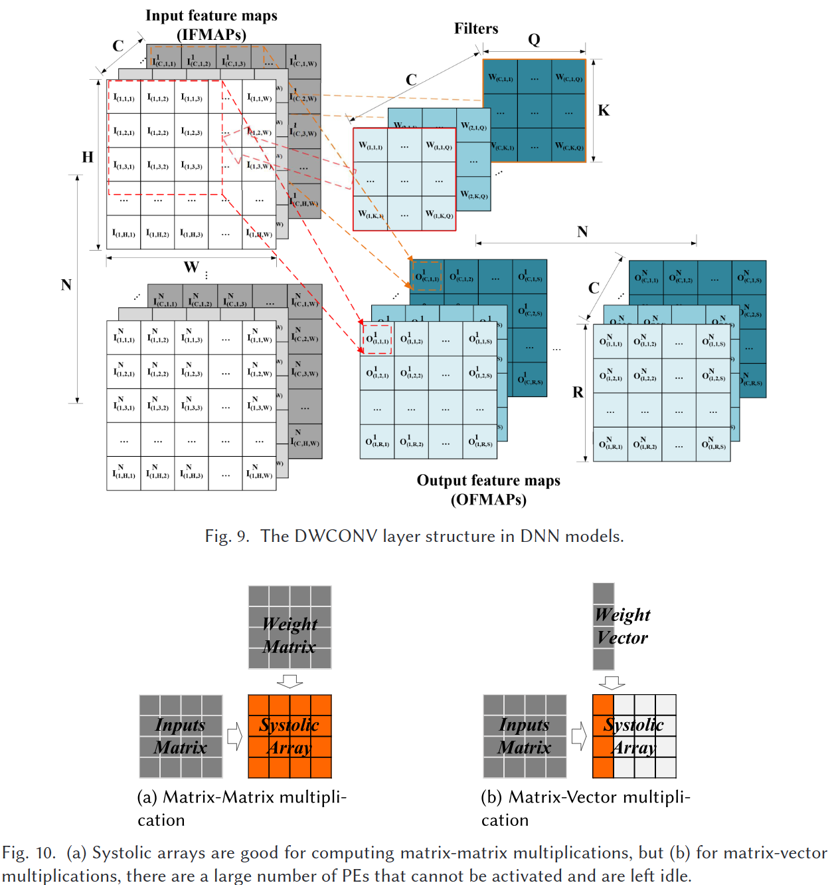

# A Survey of Design and Optimization for Systolic Array-based DNN Accelerators [1]

## Abstract
- Systolic Arrayは近年DNN hardware acceleratorの設計において成功を収めている
- DNNの構造や用途が複雑化するに伴って研究が活発化している．

## 1. Introduction

- DNNの発展に伴い，データ処理および計算能力に対する要求が指数関数的に増加している
- 一方で，ムーアの法則やデナードスケーリングの終焉により，「電力の壁」や「メモリの壁」といった課題が生じている．
- そのため，GPU，FPGA，ASICといった高性能コンピューティングプラットフォームがDNNアプリケーションの実行に採用されている．
- 2014年には，GoogleがSystolic Array-based DNN AcceleratorsであるTensor Processing Unit（TPU）を提案．
- これを皮切りに，Systolic Array-based DNN Acceleratorsの研究が活発化．
- Systolic Arrayは，一般にはデータフローのパイプライン化，データ再利用，並列処理などの特性を持ち，DNNの計算要件に適している．
- しかし，DNN技術は常に進化しており，従来のSystolic Arrayアーキテクチャでは新しいアルゴリズムや最適化技術に対応できないことがある．
    - e.g., Pruiningと，その sparsityの活用
    - e.g., Cloud Server, Mobile DeviceといったApplication 固有の性能・コスト要求に応じたアーキテクチャの設計
- ということで，本論文では，Systolic Array-based DNN Acceleratorsについて調べるよ

## Table of Contents
2. [BACKGROUND](background): Systolic Arrayの概要と設計上の課題
3. [OPTIMIZATION FOR FLEXIBILITY](): Systolic Arrayの柔軟性向上の研究
4. [OPTIMIZATION FOR SPARSITY](): DNNのスパース性への対応と最適化に関する研究
5. [DESIGN AUTOMATION AND EVALUATION STRATEGY](): 自動合成，性能Emulation，ツール等
6. [CONCLUSION AND FUTURE DIRECTIONS](): まとめと将来の研究動向

# 2. BACKGROUND

## 2.1 History of Systolic Array
- 1970年代後半，並列計算のための既存の計算機アーキテクチャ，例えばフォン・ノイマンアーキテクチャの限界が顕著になりつつあった．
- 画像処理やCGといったアプリケーションが急速に発展し，それらを支える高性能な計算機
アーキテクチャが必要とされるようになった．
- 利用可能なリソースを最大限に活用して計算性能を向上させる新しいアーキテクチャを模索する動きが活発化
- その過程でシストリックアレイが注目を集める．
- 1978年，H.T. Kungは過去の研究を詳細にまとめ，Systolic Arrayの概念を提唱[2]．
    - 単純な処理要素のArray 
    - 心臓(systolic)の拍動のように連動
    - 並列パイプライン
- 1980年代から1990年代にかけて，Systolic Arrayに対する関心が高まるが…
    - GPU，FPGA，マルチコアプロセッサなど，より柔軟でプログラム可能なアーキテクチャへの関心が移行
- 近年，DNNの台頭によって，関心が再燃
    - 大量の行列演算を必要とするDNNに対して，Systolic Arrayは適している
    - 各計算セルが単純で，制御ロジックが複雑でないため，計算効率が非常に高い
    - 上手く設計すればデータをArray内でキャッシュして再利用できる
    - 結果として高いThroughputと低消費電力が実現可能

## 2.2 Systolic Array 

- 図は2D Systolic Arrayの典型的な設計
    - homogeneous で相互接続された処理要素（PE）
        - 基本的な算術ユニットとレジスタユニットで構成
        - 積和演算（MAC）をサポート
    - Controller Module
    - On-chip memory/buffer
- データは，Array内のPEを一定のリズムで通過して処理される
    - 心血管系の動作に似ているため，Siostolic Arrayと呼ばれる
- 🥰行列/テンソル計算（遠くに行列積）でデータの再利用性が高い
- 🥰I/Oと計算の不均衡解消
    - Array内のデータはPE間でパイプラインモデルで流れ，外部バッファとの通信は境界PEでのみ
    - 多くのPEが外部メモリと通信する必要がなくなり，メモリ帯域幅の要求を大幅に削減
- 🥰規則的な構造による設計コストの削減
    - 繰り返し利用される少数の単純なブロックで構成
    - シンプルなインターフェースと接続ネットワーク
- 🥰優れたスケーラビリティ
    - 性能・コスト要件目標に応じて調整可能
- 🥰高効率なデータ移動
    - データ通信はPE内のレジスタのパイプラインによって実行
    - 他の設計（e.g., broadcast, multicast）と比較して 
        - ルーティング機構を必要としない
        - 通信や同期のオーバーヘッドが非常に小さい
        - 結果として必要な電力消費，時間，面積が小さい

## 2.3 The Terminology of Systolic Array Design

### 2.3.1 Workloads
- DNNはさまざまな層で構成される
    - 完全結合層（Fully Connected, FC）
        - 入力と出力のすべてのユニットが接続
        - 通常は，3重のループで表される
    - 畳み込み層（Convolutional, CONV）
        - Feature Map（FMAP）とConvolution Filterが複数ある
        - 各入力チャネルは対応するフィルタ内のカーネルで畳み込まれる
        - すべての入力チャネルの結果が累積されて出力FMAPが得られる
        - 通常，7重のループで表される
    - ...

### 2.3.2 Loop Unrolling
- Workloadの並列性を抽出するためにLoopの処理を時空間的に展開
- e.g., FC Layerのloop1とloop2をハードウェア上で空間的に展開し，並列に計算

### 2.3.3 Dataflow
- Output Stationary, OS
    - 出力要素を対応するPEにマッピング
    - 各PEは，1つの出力要素に必要なすべての計算を完了
- Weight Stationary, WS
    - 計算前に重み行列の要素を各PEに事前配置し
    - 入力データをアレイの左端から流す
- Input Stationary, IS
    - 入力データを各PEに事前配置し，計算が行われる

### 2.3.4 Array Size
- Workloadは通常，Systolic Arrayのサイズを超える
- 複数のタイルに分割し，順次実行することで対応

### 2.3.5 On-chip Buffer and Bandwidth
- On-chip Bufferはデータを一時的に格納し，計算結果をキャッシュ
- 適切なサイズのバッファがないと，頻繁なオフチップメモリアクセスが発生

### 2.3.6 Design Space
- Workload，Dataflow，Array Size，On-chip Buffer
- これらのパラメータを調整し，最適な設計を探索する

## 2.4 Challenges of Systolic Array Design

### 2.4.1 Infexibility

- Systolic Arrayは，特定のWorkloadに対しては，効率が低下する
- e.g., FC Layer🥰
    - 行列積演算なので，2D Sysolic Arrayに直接マッピング可能

- e.g., CONV Layer🥰
    - 直接はマッピングできないが，im2colを用いて，CONV Layerを行列積に変換することで，Systolic Arrayにマッピング可能

- e.g., Depthwise Convolution🥲
    - 入力のChannelごとにfilter を持ち独立して畳み込み
    - 行列ベクトル積となり，多くのPEがアイドル状態，性能が著しく低下

- e.g., Delited Convolution, Inverse Convolution🥲
    - ゼロ要素が多く，無駄な計算が増える
- e.g., Batch Normalization, Softmax, Activation Function🥲

- 一つの解決策として，Systolic Array とホストでうまく分業する…？
    - 一般的なプロセッサは，DNNの計算が非効率的であり🥲
    - ホストが計算を完了するまで，シストリックアレイはアイドル状態🥲

### 2.4.2 DNN sparsity 
- 近年，DNNのスパース性（疎性）は研究のホットトピック
- 重みや活性化行列（またはテンソル）の多くの要素がPruining可能
- Systric Arrayは，密な行列やテンソルの計算にのみ対応
    - スパース行列やテンソルをゼロ要素で埋めてできなくはないが
    - スパース性を利用して高速化することは難しい

### Complex Design Space
- DNNの発展は早いので，迅速な対応が必要
- しかし，Systolic Arrayの設計は容易ではない
    - Systemic Arrayの設計空間には多くのパラメータや要因が関係している．
    - 相当の知識と経験，時間とコストが必要
- また，Application も多様
    - e.g., Training 高いスループットとPEの利用率が重要
    - e.g., Inference 低遅延が重要
    - e.g., Mobile/Embedded Platform 面積と消費電力の厳しい制約
    - これらに対応できる汎用性が求められる
- そこで，自動化が重要
    - e.g., 自動化設計ツール：異なるプラットフォーム向けに特定のアプリケーションに最適化されたシストリックアレイ設計を自動的に生成する 
    - e.g., 評価ツール：設計者がシストリックアレイ設計の性能，エネルギー消費，面積，その他の指標を理解しやすくするためのツールや戦略

# 3. OPTIMIZATION FOR FLEXIBILITY

# 4. OPTIMIZATION FOR SPARSITY

# 5. DESIGN AUTOMATION AND EVALUATION STRATEGY

# 6. CONCLUSION AND FUTURE DIRECTIONS

### Reference
1. Rui Xu, Sheng Ma, Yang Guo, and Dongsheng Li. 2023. A Survey of Design and Optimization for Systolic Array-based DNN Accelerators. ACM Comput. Surv. 56, 1, Article 20 (January 2024), 37 pages. https://doi.org/10.1145/3604802
2. Kung, "Why systolic architectures?," in Computer, vol. 15, no. 1, pp. 37-46, Jan. 1982, https://doi.org/10.1109/MC.1982.1653825.
