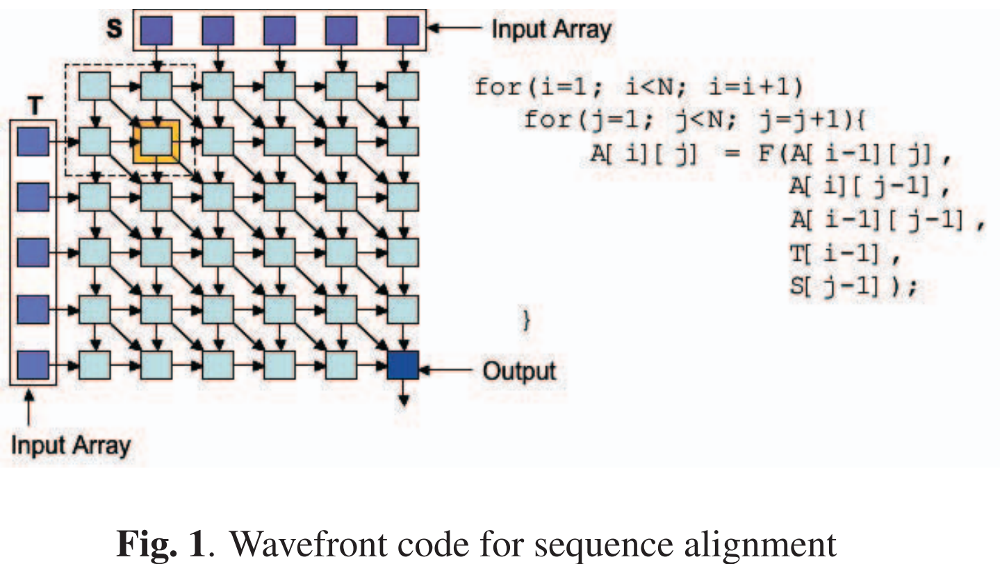
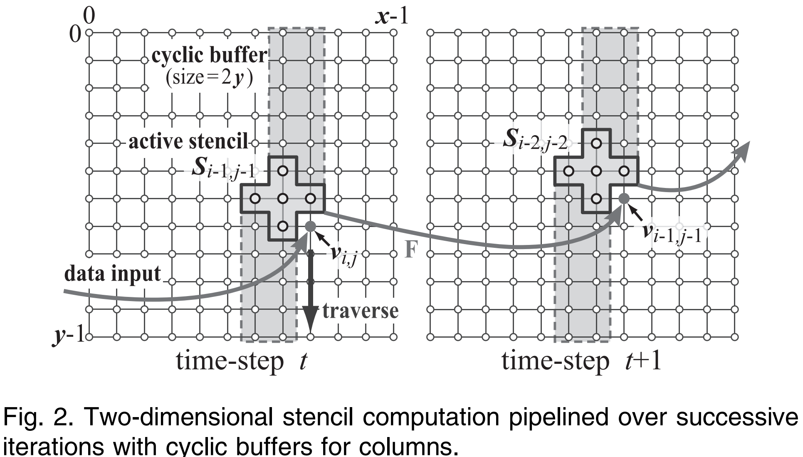

# Systolic Array Applications

Systolic Arrayが適用される代表的なアプリケーションについて

## DNN Accelerator [1]
- 2014年，Google Tensor Processing Unit（TPU）皮切りに，Systolic Array-based DNN Acceleratorsの研究が活発化．
- 行列/テンソル計算（遠くに行列積）でデータの再利用性が高い
- Array内のデータはPE間でパイプラインモデルで流れ，外部バッファとの通信は境界PEでのみ，多くのPEが外部メモリと通信する必要がなくなり，メモリ帯域幅の要求を大幅に削減
- 優れたスケーラビリティ，性能・コスト要件目標に応じて調整可能
- 高効率なデータ移動，データ通信はPE内のレジスタのパイプラインによって実行．他の設計（e.g., broadcast, multicast）と比較して，ルーティング機構を必要としない，通信や同期のオーバーヘッドが非常に小さい

## 遺伝子配列アライメント [2]
- 遺伝子配列アライメントは，DNAやRNAの配列を比較して類似性や相違点を見つける操作
- ヒューリスティック（高速だが不正確でもよい用途向け
- Dynamic programming（正確だが計算量が膨大）
    - Needleman-Wunsch algorithm (Global)
    - Smith-Waterman algorithm (Local)
    - これらはWavefront Algorithmという枠組みになる
    - 図のように，左上から右下へ進む波が広がるようなアルゴリズム
    - Systolic Arrayを用いることで，Wavefront Algorithmを高速化できる

## ステンシル計算 [3]
- 数値計算やシミュレーションにおいて，格子（グリッド）上のデータを隣接する格子点の情報を使って更新する処理
- ステンシル計算は演算強度（キャッシュミスが発生した際に外部DRAMから読み取られるデータサイズに対する浮動小数点演算の数）が低いため，メモリ帯域幅がボトルネックになりやすい
- マルチコアやGPUだと高速化しにくい
- FPGAを用いたSystolic Arrayによる高速化が有効
    - 各グリッドポイントの計算は隣接グリッドポイントのデータのみを必要とするため通信が局所に限定される．
    - 各グリッドポイントの計算は独立しており，並列実行が可能．
- Systolic Arrayによる高速化に最適なアプリケーションの一つ
- e.g. 流体力学 [4]

## Flexible Systolic Array Platform on Virtual 2-D Multi-FPGA Plane [5]

- Systolic arrayは高い並列性をもたらすが大きなWorkloadに対してはより小さな部分に分割して処理する必要がある
- そこで，複数のFPGAを仮想ネットワークで接続した2次元FPGA平面に基づくScalableなSystolic array platformを提案
    - 複数FPGAにまたがるスケーラブルで柔軟な2次元Systolic arrayが構成可能
    - Targetに応じて形状やサイズを自由にカスタマイズ可能
    - FPGAの数に比例して処理性能が向上

## References
[1] Rui Xu, Sheng Ma, Yang Guo, and Dongsheng Li. 2023. A Survey of Design and Optimization for Systolic Array-based DNN Accelerators. ACM Comput. Surv. 56, 1, Article 20 (January 2024), 37 pages. https://doi.org/10.1145/3604802

[2] B. Buyukkurt and W. A. Najj, "Compiler generated systolic arrays for wavefront algorithm acceleration on FPGAs," 2008 International Conference on Field Programmable Logic and Applications, Heidelberg, Germany, 2008, pp. 655-658, https://doi.org/10.1109/FPL.2008.4630032

[3] K. Sano, Y. Hatsuda and S. Yamamoto, "Multi-FPGA Accelerator for Scalable Stencil Computation with Constant Memory Bandwidth," in IEEE Transactions on Parallel and Distributed Systems, vol. 25, no. 3, pp. 695-705, March 2014, https://doi.org/10.1109/TPDS.2013.51

[4] K. Sano, T. Iizuka and S. Yamamoto, "Systolic Architecture for Computational Fluid Dynamics on FPGAs," 15th Annual IEEE Symposium on Field-Programmable Custom Computing Machines (FCCM 2007), Napa, CA, USA, 2007, pp. 107-116, https://doi.org/10.1109/FCCM.2007.20

[5] Tomohiro Ueno, Emanuele Del Sozzo, and Kentaro Sano. 2024. Flexible Systolic Array Platform on Virtual 2-D Multi-FPGA Plane. In Proceedings of the International Conference on High Performance Computing in Asia-Pacific Region (HPCAsia '24). Association for Computing Machinery, New York, NY, USA, 84–94. https://doi.org/10.1145/3635035.3637285
